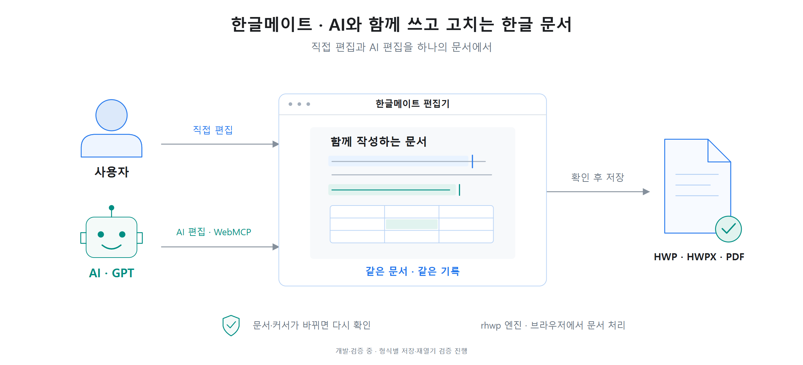
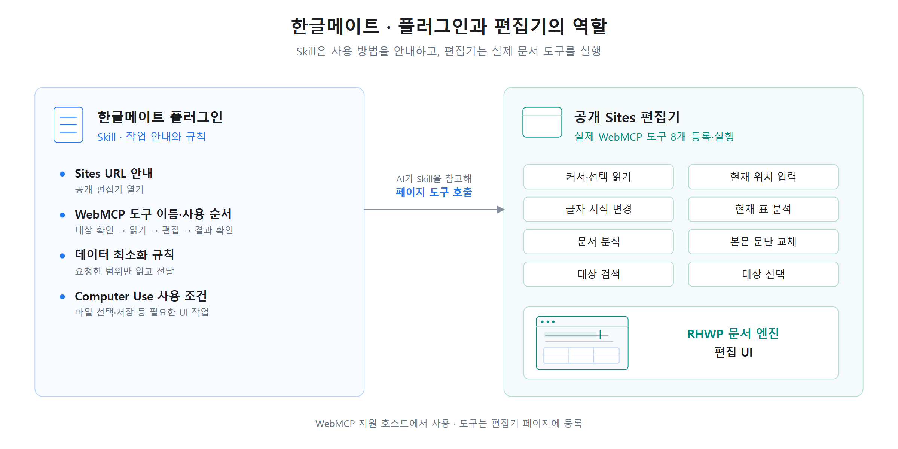

# 한글메이트 · HangulMate

**GPT와 함께 쓰고 고치는 한글 문서.**

한글 파일을 열고, 문장과 표를 AI와 함께 수정하는 공동 편집 플러그인입니다.
현재 시험 배포 중이며, 형식 호환성과 Windows·macOS 실사용 검증을 진행하고 있습니다.

[편집기 열기](https://hangulmate-webmcp-poc.gptisgod.chatgpt.site/) · [시작·설치 안내](docs/SITES-QUICKSTART.md) · [개발 현황](https://github.com/users/ajh1004ajh00/projects/2) · [문제 제보](https://github.com/ajh1004ajh00/hwpx-desktop-plugin/issues)

개발자 **AnJuHyun** · [지원](docs/SUPPORT.md) · [개인정보 안내](docs/PRIVACY.md) · [이용약관](docs/TERMS.md)

## 사용하기



ChatGPT Desktop에서 한글메이트 플러그인을 설치한 뒤 새 대화에서 **“한글메이트 열어줘”**라고 요청하면 바로 시작합니다. [시작 안내](docs/SITES-QUICKSTART.md)를 참고하세요.

1. 편집기의 **파일 → 열기**에서 HWP/HWPX 파일을 선택합니다.
2. 수정할 곳에 커서를 놓거나 텍스트를 선택한 뒤 AI에게 요청합니다.
3. **최근 AI 변경**과 문서를 확인하고, 파일 메뉴에서 저장합니다.

예를 들어 “선택한 문장을 간결하게 바꿔줘”, “현재 셀에 참가 목적을 써줘”, “선택한 글자를 굵게 바꿔줘”라고 요청할 수 있습니다.

## 현재 지원 범위

| 항목 | 지원 내용 |
| --- | --- |
| 문장·표 편집 | 일반 본문과 최상위 표 셀에서 같은 문단의 텍스트 입력·교체 |
| 글자 서식 | 선택한 글자의 글꼴·크기·굵게·기울임·밑줄·취소선·색상 변경 |
| 읽기·분석 | 선택 영역, 본문, 최상위 표의 내용과 서식 확인 |
| 대상 찾기 | 지정한 구절의 문자열 일치 검색·선택 |
| 파일 | HWP/HWPX 열기·저장, 브라우저 인쇄를 통한 PDF 출력 |

중첩 표, 여러 문단·셀에 걸친 선택, 머리말·꼬리말 등은 AI 편집 지원 범위에서 제외됩니다. 파일별 호환성과 저장·재열기, PDF 배치는 검증 중입니다. [세부 편집 규칙](skills/hwpx-desktop/SKILL.md)

문서나 커서가 바뀌면 AI가 대상을 다시 확인합니다. 변경을 되돌릴 때는 문서의 실행 취소를 사용하고, 새로고침·종료 전에 파일을 저장하세요. **최근 AI 변경**은 확인용 표시 기록이며, 문서의 현재 상태나 저장 완료를 뜻하지 않습니다.

## 플러그인 구조



구현은 [플러그인 Skill](skills/hwpx-desktop/SKILL.md), [WebMCP 도구](desktop/studio-tools.mjs), [편집 브리지](desktop/cursor-bridge.mjs)에서 확인할 수 있습니다.

## 문서 데이터는 어디에서 처리하나요?

문서 파싱과 화면 표시는 브라우저에서 처리합니다. AI에게 요청한 선택 텍스트와 표·문서 분석 결과는 ChatGPT에 전달됩니다. 브라우저에 복구본과 작업 이력이 남을 수 있으며, 방문자끼리 문서를 자동 공유하지는 않습니다. [데이터 처리 기준](docs/DATA-POLICY.md)

## 로컬 개발

Node.js 24 이상과 Git이 필요합니다. 첫 설정에서는 의존성과 고정된 upstream Studio를 내려받습니다.

```sh
git clone https://github.com/ajh1004ajh00/hwpx-desktop-plugin.git
cd hwpx-desktop-plugin
npm run setup
npm start
```

내장 브라우저에서 `http://127.0.0.1:4175/desktop/`를 엽니다. 다른 포트를 사용하려면 `HWPX_DESKTOP_PORT` 환경 변수를 설정하세요.

```sh
npm test
npm run build
```

[기여 규칙](CONTRIBUTING.md) · [배포·검증 기록](docs/SITES-POC.md) · [실사용 검증 안내](docs/REVIEW-HANDOFF.md) · [제출 자료 초안](docs/SUBMISSION.md) · [최신 Windows 검증](docs/RELEASE-READINESS-2026-09-18.md) · [마일스톤](https://github.com/ajh1004ajh00/hwpx-desktop-plugin/milestones)

<details>
<summary>구조도 편집용 SVG</summary>

- [공동 편집 사용 흐름](docs/images/hangulmate-architecture-ko.svg)
- [플러그인·Sites 편집기 구조](docs/images/hangulmate-plugin-architecture-ko.svg)

</details>

## 출처·라이선스

- 원본 프로젝트: [hwpx-document-plugin](https://github.com/taejung3852/hwpx-document-plugin)
- 문서 엔진·편집 UI: [rhwp](https://github.com/edwardkim/rhwp)
- [MIT License](LICENSE) · [의존성·폰트 고지](THIRD_PARTY_NOTICES.md)

한글메이트는 임시 제품명입니다. 현재 플러그인 심사 승인본이 아니며, OpenAI 또는 한글 제품 공급자의 공식 제품이 아닙니다.
