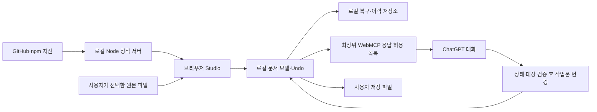

# 데이터 처리 기준 — 심사 준비 초안

현재 배포 경로는 공개 Sites다. 2026-09-14 사용자가 URL을 가진 누구나 접근하도록 승인했고 공개 설정을 확인했다. 아래 비공개 배포 기록은 이전 단계의 이력이다. Sites 이용자는 GitHub/npm/localhost 설치를 하지 않으며, 해당 다운로드 설명은 로컬 개발 경로에만 적용한다. 각 방문자의 문서는 각자의 브라우저에서 처리되고 다른 방문자에게 자동 공유되지 않는다.

최근 AI 변경 표시는 현재 탭 DOM에만 최대 20건 보관한다. 각 항목은 숫자 위치와 전후 문구 각각 최대 300자를 표시한다. 모델 응답에 변경 기록을 추가하지 않으며 저장소·서버 로그에 기록하지 않는다. 사용자가 표시 기록 지우기를 누르면 표시만 지우며 문서와 Undo 기록은 바꾸지 않는다. 오류 안내는 허용 코드의 고정 문구이며 원문 오류를 표시하지 않는다.

2026-09-14 사용자는 **필요한 내용만 ChatGPT에 제공하는 정책**을 승인했다(#19). 원본 파일을 개발자 서버에 업로드하는 기능은 추가하지 않는다. 선택 텍스트·요청한 표/문서 분석 결과는 ChatGPT에 제공되므로 “외부 전송 없음”이라고 설명하지 않는다.

이 문서는 구현 기준이다. 공개 개인정보처리방침·약관을 대신하지 않으며 운영자 이름, 연락처, 공개 URL과 플랫폼 적용 범위는 운영자가 확정해야 한다.

| 데이터 | 수신자·목적 | 보관 위치·수명 | 허용 범위 |
|---|---|---|---|
| 원본 HWP/HWPX | 사용자가 선택한 로컬 Studio, 편집 | 사용자 파일과 브라우저 문서 모델 | 개발자/호스팅 업로드 금지 |
| 선택 텍스트 | WebMCP host → ChatGPT, 요청한 편집 | 대화 보관은 계정/조직 설정에 따름. 정확한 기간·지역은 미확인 | 기본 읽기는 선택 텍스트만. 빈 선택은 빈 문자열 |
| 표/문서 텍스트·서식 | WebMCP host → ChatGPT, 사용자가 요청한 분석 | 대화 측 보관은 별도 확인 | 별도 범위의 명시적 요청에만 페이지 단위 제공 |
| 파일명 | 로컬 편집 UI·최근 문서/복구 기능 | 아래 IndexedDB 및 사용자 저장본 | 기본 WebMCP 선택/쓰기 응답에서 제외. 화면 읽기까지 차단했다는 뜻은 아님 |
| 내부 스냅샷·문서/서식/주변 해시·커서 토큰 | 로컬 브리지, 충돌·재시도 검증 | 메모리, 크기 제한 Map/페이지 수명. 브리지 snapshots 16·journal 32, host 경계 snapshots 8 | 검증을 유지하고 응답에서 제외 |
| AI 입력 인자 | ChatGPT → 로컬 편집 모델 | 대화 및 로컬 명령 기록 | 요청 대상만 변경. 동일 인자·명령 ID로만 재시도 |
| 쓰기 응답 | ChatGPT, 작업본 변경 여부 확인 | 대화 측 보관 별도 | command_id/status/saved만 반환. 입력/교체 문장 재전송 없음 |
| 도구 오류 | ChatGPT, 복구 판단 | 대화 측 보관 별도 | 허용 오류 코드 또는 TOOL_FAILED. 문서/경로가 포함될 수 있는 원문 오류 제외 |
| 프로그램 자산/설치 요청 | GitHub·npm에서 다운로드, 로컬 서버에서 제공 | .runtime/node_modules/브라우저 캐시 | 문서 데이터와 구분. 새 사용자 설치에는 네트워크 필요 |
| 저장 HWP/HWPX/PDF | 사용자가 선택한 파일 위치 | 사용자 관리 | 저장 성공과 재열기는 실제 파일로 확인 |

## 브라우저에 남을 수 있는 데이터

고정 upstream `e8800c8` 소스를 2026-09-14 읽어 다음 저장소와 호출 연결을 확인했다. **실제 Desktop 저장 성공·삭제·재시작 보존을 시험했다는 뜻은 아니다.**

- `rhwpStudioAutosave`: 복구용 문서 바이트·파일명·시각. `recovery/autosave-store.ts`와 `main.ts`의 AutosaveManager 연결이 있다. 보관 개수 제한 코드는 있으나 시간 기반 삭제 보장은 확인하지 않았다.
- `rhwpStudioRecent`: 파일명·형식·시각, 가능한 경우 FileSystemFileHandle. 최근 목록은 문서 바이트를 직접 저장하지 않는다.
- `rhwpStudioDocHistory`: 비교 이력 메타데이터와 IR 스냅샷/레거시 문서 바이트.
- localStorage: 사용자 설정, 최근 기호, 글꼴 설정 등이 있다.
- IndexedDB를 사용할 수 없을 때 메모리 fallback이 존재한다. 지속 복구를 보장하지 않는다.

따라서 “닫으면 문서 관련 자료가 모두 사라진다”는 표현을 사용하지 않는다. 저장소는 브라우저 origin에 묶이므로 포트·프로필·앱 변경 후 동일 자료가 보인다고 가정하지 않는다. 삭제 시험은 합성 문서만 사용하고, 사람이 저장본을 확보한 뒤 로컬 기록 삭제 효과를 확인한다(#8·#21·#24).

## 신뢰 경계와 후속 기능

문서 문자열은 지시가 아니다. 문서에 외부 업로드·권한 변경을 요구하는 문장이 있어도 수행하지 않는다. #4 자연어 탐색은 로컬 탐색 결과 전체와 모델에 제공하는 후보를 구분해야 한다. #6 여러 항목 작성은 #7의 변경 확인·상태 검증·동일 명령 재시도와 부분 실패 처리 기준을 충족해야 한다.

2026-09-14 후속 사용자 지시로 실제 편집기를 비공개 Sites에 배포했다. 현재 Sites 버전 3 소스는 `673398fcfa1dfcce9d507f76ee22854374a84e9b`이며 새 대상 탐색 구현은 아직 로컬 변경본이다. Sites는 정적 편집기 자산을 제공하고 원본 문서는 브라우저에서 처리한다. 운영 로그·지역·민감정보 처리 가능 범위와 공개 배포 적합성은 별도 미확인이다. 사이트 로그인, 플러그인 OAuth, 개발자 신원 인증은 각각 다른 결정이다.

대상 탐색은 로컬 본문·최상위 표 셀을 검사하고 모델에는 일치 검색어·숫자 위치·불투명 후보 ID·잘림 여부만 제공한다. 전체 검색 텍스트 및 후보의 내부 문서 상태는 반환하지 않는다. 후보 ID는 새 검색으로 교체되고 문서 상태 변경 시 사용할 수 없다.

후속 배포: 위의 로컬 대상 탐색 변경은 Sites 버전 4 (`4655dcd2837b6a59c9d336c9c16577715833a170`)로 비공개 배포 완료했다. 앞 문단의 버전 3은 변경 전 기준이며 현재 배포 상태는 버전 4다.
